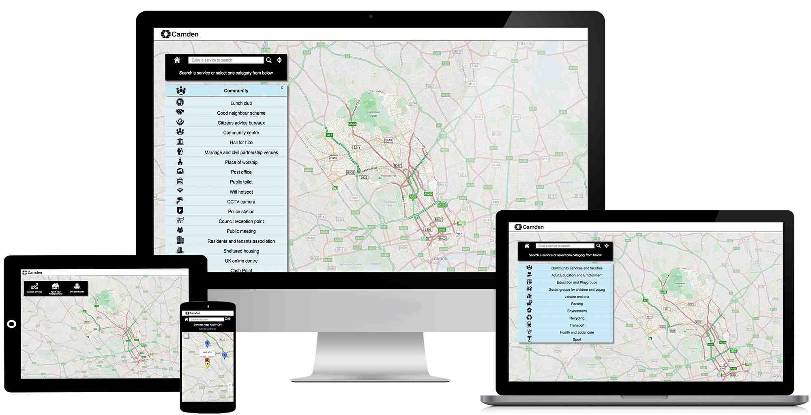

#Responsive Web Design

We build beautiful responsive websites. As a standard practice, we build mobile first and practice *progressive enhancement* of the user experience, so our websites and web applications are always mobile ready, but also pleasant to view on a desktop.

